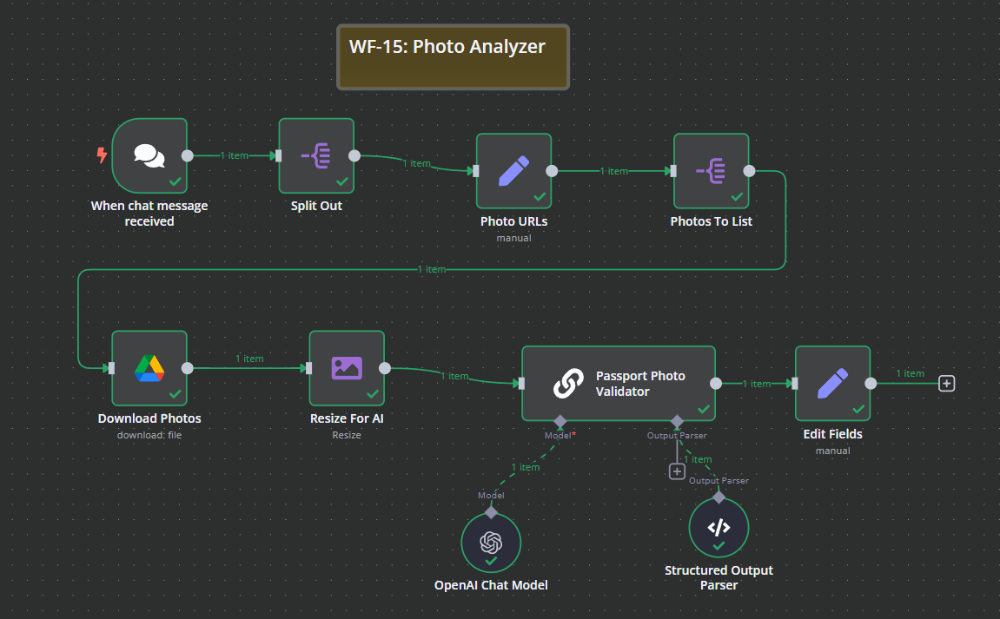

# WF-15: Photo Analyzer – n8n Workflow

## 📌 Overview
This **n8n workflow**, `WF-15: Photo Analyzer`, automates the validation and analysis of uploaded passport photos. It checks if an image meets the official UK passport photo criteria, describes its contents, and provides reasons if it is deemed invalid.

## 🔧 Workflow Components
### 🏗️ Core Modules
1. **💬 Chat Trigger** – Listens for messages containing Google Drive photo URLs.
2. **🔗 URL Extractor** – Identifies and extracts valid Google Drive links from the message.
3. **📥 Google Drive Downloader** – Downloads the image from the extracted URL.
4. **📏 Image Resizer** – Resizes the image for AI processing.
5. **🤖 Passport Photo Validator** – Uses AI to check if the photo meets UK passport requirements.
6. **📜 Structured Output Parser** – Parses AI-generated responses into a structured format.
7. **📝 AI-Based Description Generator** – Provides a description of the image, including colors and objects.
8. **✅ Result Formatter** – Structures the validation results and generates a response message.

## ⚙️ How It Works
1. 💬 The **Chat Trigger** detects a message containing a **Google Drive link** to an image.
2. 🔗 The **URL Extractor** extracts the valid link.
3. 📥 The **Google Drive Downloader** retrieves the image.
4. 📏 The **Image Resizer** ensures the image is correctly formatted for AI validation.
5. 🤖 The **Passport Photo Validator** checks the image against **UK passport photo standards**.
6. 📜 The **Structured Output Parser** extracts the AI-generated validation results, including:
   - Whether the image is **valid or invalid**.
   - A **detailed description** of the image.
   - Reasons for **rejection** (if applicable).
7. ✅ The **Result Formatter** compiles a response summarizing the validation results.

## 📷 Workflow Screenshot

## 🚀 Setup Instructions
- 📥 **Import the workflow** into `n8n`.
- 🔑 **Ensure API credentials** for OpenAI and Google Drive are configured.
- ✅ **Activate the workflow** to start processing passport photo validations.

## 📝 Notes
- ⚠️ The workflow is **inactive by default**.
- 🛠️ Modify the AI prompts to adapt to different country-specific passport photo requirements.
- 💡 Can be expanded to **support additional document types** for validation.
